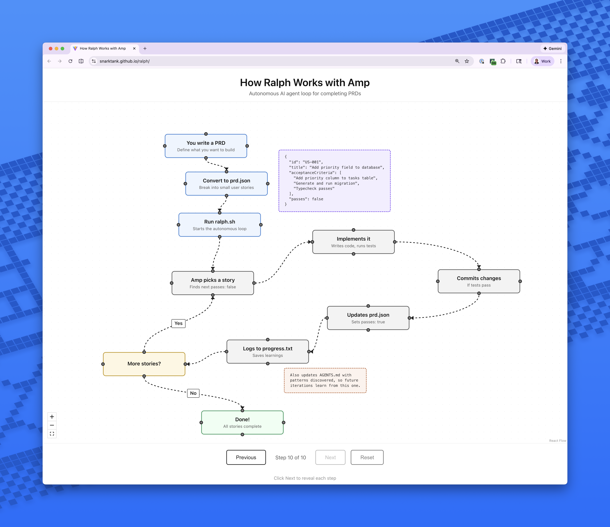

# Ralph v2

This is the script you can use to install this from every where
/Users/M060883/git/wdp/mcp/ai-toolkit/ralph/install.sh 


Ralph is an autonomous AI agent loop that runs [Amp](https://ampcode.com) repeatedly until all tasks are complete. Each iteration is a fresh Amp instance with clean context.

**v2 Architecture:** Three-phase system (Librarian → Oracle → Worker) with a single `tasks.md` file for state management.

Based on [Geoffrey Huntley's Ralph pattern](https://ghuntley.com/ralph/).

[Read my in-depth article on how I use Ralph](https://x.com/ryancarson/status/2008548371712135632)

## Prerequisites

- [Amp CLI](https://ampcode.com) installed and authenticated
- A git repository for your project

## Quick Start

```bash
# 1. Copy tasks.md.example and customize
cp tasks.md.example tasks.md

# 2. Edit tasks.md with your goal
#    - Goal: <what you want to build>
#    - Branch: ralph/<feature-name>
#    - Status: PLANNING_PENDING

# 3. Run planning (oracle creates task breakdown)
./ralph.sh plan

# 4. Validate the task structure
./ralph.sh validate

# 5. Review tasks.md, then run workers
./ralph.sh [max_iterations]

# 6. Check progress anytime
./ralph.sh status
```

## Commands

| Command | Description | When to Use |
|---------|-------------|-------------|
| `./ralph.sh plan` | Run oracle to create task breakdown from goal | After setting up tasks.md with your goal |
| `./ralph.sh validate` | Validate tasks.md structure (format, dependencies) | After planning, before running workers |
| `./ralph.sh status` | Show progress dashboard with task counts | Anytime to check progress |
| `./ralph.sh [max]` | Run worker iterations (default: 10) | After planning and validation |
| `./ralph.sh help` | Show usage and environment variables | When you need help |

## Environment Variables

| Variable | Default | Description |
|----------|---------|-------------|
| `RALPH_MODEL` | Auto-detected | Override the AI model (e.g., `claude-sonnet`) |
| `RALPH_MAX_RETRIES` | `2` | Maximum retry attempts on failure |
| `RALPH_RETRY_DELAY` | `30` | Base delay in seconds for exponential backoff |

Example usage:

```bash
# Use a specific model
export RALPH_MODEL="claude-sonnet"

# More retries with longer delay
export RALPH_MAX_RETRIES=3
export RALPH_RETRY_DELAY=60

./ralph.sh
```

## How It Works

Ralph v2 uses a two-step workflow:

| Step | Command | Tool | Purpose |
|------|---------|------|---------|
| 1 | `./ralph.sh plan` | **Oracle** | Breaks goal into small tasks |
| 2 | `./ralph.sh` | **Worker** + **Librarian** | Implements tasks, updates context |

```
┌─────────────────────────────────────────────────────────────┐
│                        tasks.md                              │
│  ┌──────────────┐   ┌─────────────────────────────────────┐ │
│  │ Project      │   │ Task List                           │ │
│  │ - Goal       │   │ T001 [x] Add priority - Notes...    │ │
│  │ - Branch     │   │ T002 [ ] Create UI (Depends: T001)  │ │
│  │ - Status     │   │ T003 [ ] Add filter (Depends: T002) │ │
│  └──────────────┘   └─────────────────────────────────────┘ │
└─────────────────────────────────────────────────────────────┘
         ↑                         ↑
     You write              Oracle creates (plan)
                                   │
                                   ↓
                           Worker implements
                           Librarian writes context
```

## Key Files

| File | Purpose |
|------|---------|
| `ralph.sh` | Phase-based bash loop with retry logic |
| `tasks.md` | Single source of truth (goal, tasks, notes) |
| `tasks.md.example` | Template to copy |
| `prompt.md` | Worker prompt (uses librarian for context) |
| `prompt.plan.md` | Planning prompt (uses oracle) |
| `skills/` | Amp skills for PRD and conversion |
| `flowchart/` | Interactive visualization |
| `.ralph/history/` | Execution logs (JSONL format) |

## tasks.md Structure

```markdown
# Ralph Tasks

## Project
- Goal: Add priority levels to tasks
- Branch: ralph/task-priority
- Status: PLANNING_PENDING
- Updated: 2026-01-30

## Task List
> Created by `./ralph.sh plan`, executed by Worker

### T001 - Add priority column
- Status: [ ] TODO
- Priority: P1
- Depends: 
- Outcome: Tasks table has priority column
- Context:
  - `db/schema.ts`
- Checks:
  - `npm run typecheck`
- Notes:
  - Thread: <amp thread url>
  - Changed: Added priority enum column
  - Files: `db/schema.ts`, `db/migrations/001.sql`
  - Findings: Use sql`CREATE TYPE` for enums
  - Next context: `src/types/task.ts` needs type export

### T002 - Create PriorityBadge component
- Status: [ ] TODO
- Priority: P1
- Depends: T001
- Outcome: Reusable badge component for priority display
- Context:
  - `src/components/Badge.tsx`
- Checks:
  - `npm run typecheck`
  - `npm test`
- Notes:
  - (written by worker after completion)
```

## Task Dependencies

Tasks can specify dependencies using the `- Depends:` field:

```markdown
### T003 - Add priority filter
- Status: [ ] TODO
- Depends: T001, T002
```

Ralph will:
1. Only run tasks whose dependencies are all complete (`[x]`)
2. Skip blocked tasks and report BLOCKED if no tasks are ready
3. Allow parallel-safe tasks to run when their dependencies are satisfied

Run `./ralph.sh validate` to check for:
- Invalid dependency references
- Circular dependencies
- Malformed task structure

## Status Flow

```
PLANNING_PENDING → IMPLEMENTING → COMPLETE
   ./ralph.sh plan   ./ralph.sh
```

## Model Configuration

Override model via environment variable:

```bash
export RALPH_MODEL="claude-sonnet"
./ralph.sh
```

## Critical Concepts

### Each Iteration = Fresh Context

Each iteration spawns a **new Amp instance** with clean context. Memory persists via:
- Git history (commits)
- `tasks.md` (codebase map, task notes, findings)
- `.ralph/history/` (execution logs)

### Small Tasks

Each task should be small enough to complete in one context window (~15-30 min of work).

✅ Right-sized:
- Add a database column
- Create a UI component
- Add a filter dropdown

❌ Too big (split these):
- "Build the dashboard"
- "Add authentication"

### Context Pointers

Each task includes `Context:` with file paths. Workers read these first instead of searching the whole codebase. This saves tokens.

### Notes for Next Iteration

After completing a task, Worker writes:
- What changed
- Files modified
- Findings/gotchas
- Relevant files for next task

This context helps subsequent Workers avoid re-discovering the same information.

### Retry Logic

When an iteration fails, Ralph automatically retries with exponential backoff:
- First retry: `RALPH_RETRY_DELAY` seconds (default: 30)
- Second retry: `2 × RALPH_RETRY_DELAY` seconds
- Maximum attempts: `RALPH_MAX_RETRIES + 1`

All attempts are logged to `.ralph/history/`.

## Troubleshooting

### Common Issues

| Issue | Cause | Solution |
|-------|-------|----------|
| "Tasks not planned yet" | Status is PLANNING_PENDING | Run `./ralph.sh plan` first |
| "BLOCKED: TODO tasks exist but dependencies not satisfied" | Dependencies not complete | Check `- Depends:` fields; ensure prerequisite tasks are `[x]` |
| "Circular dependency detected" | Tasks depend on each other | Run `./ralph.sh validate` to find the cycle |
| "Unknown status" | Invalid Status field | Set status to `IMPLEMENTING` or `COMPLETE` |
| "Missing tasks.md" | File not created | Copy from `tasks.md.example` and customize |
| "Max retries exhausted" | Repeated failures | Check `.iteration-log.txt`; increase `RALPH_MAX_RETRIES` |

### Debugging Commands

```bash
# Check current status
grep "^- Status:" tasks.md

# See which tasks are done
grep -E "^### T[0-9]|^- Status:" tasks.md

# Check task dependencies
grep -E "^### T[0-9]|^- Depends:" tasks.md

# Validate task structure
./ralph.sh validate

# View progress dashboard
./ralph.sh status

# Check git history
git log --oneline -10

# View execution history
cat .ralph/history/$(date +%Y-%m-%d).jsonl | jq .

# Check last iteration output
cat .iteration-log.txt
```

## Archiving

Ralph automatically archives `tasks.md` when you switch branches. Archives go to `archive/YYYY-MM-DD-feature-name/`.

## Migration from v1

If you have existing `prd.json` files:

1. Create `tasks.md` from template
2. Copy goal/branch from `prd.json`
3. Set `Status: PLANNING_PENDING` (skip Librarian if you know the codebase)
4. Let Oracle convert your user stories to tasks

Or manually convert:
- `prd.json` user stories → `tasks.md` Task List
- `progress.txt` patterns → `tasks.md` Codebase Map

## Flowchart

[](https://snarktank.github.io/ralph/)

**[View Interactive Flowchart](https://snarktank.github.io/ralph/)**

```bash
cd flowchart && npm install && npm run dev
```

## References

- [Geoffrey Huntley's Ralph article](https://ghuntley.com/ralph/)
- [Amp documentation](https://ampcode.com/manual)
